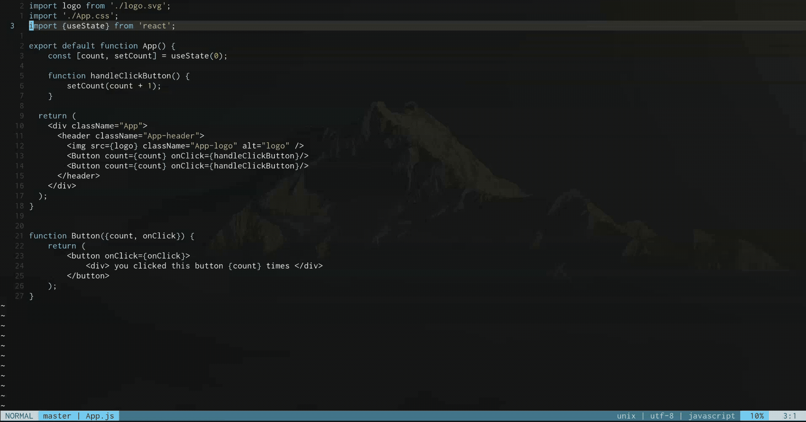
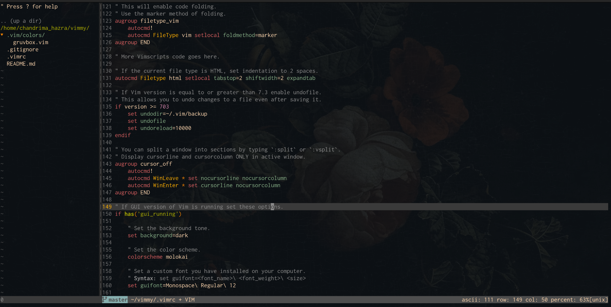
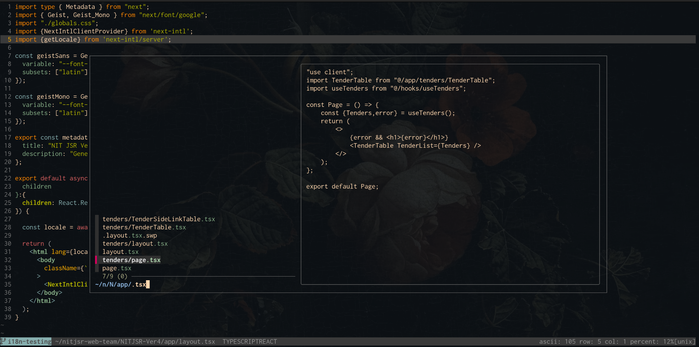
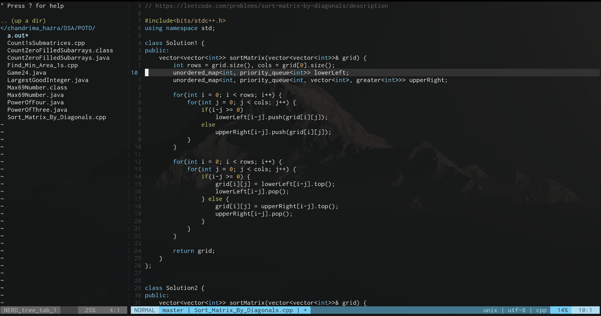
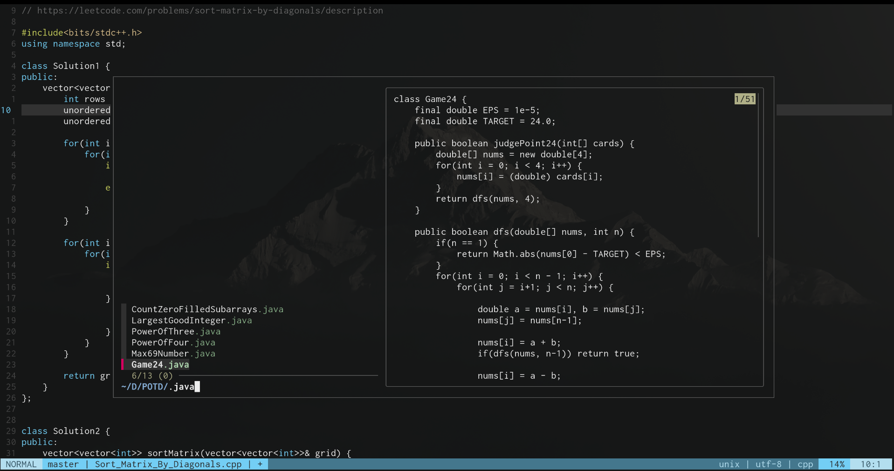

# My minimal vimrc



This is a simple and minimal vim configuration that I use.
Honestly, I don't know why I made this. No one's gonna read this... but if you reached here, thank you for your time.

Anyways, I'll be switching to NeoVim very soon, so I just wanted to start with Vim first.


## Low-key features this vimrc offers

- Colorschemes: Gruvbox, Tender (Tender is my personal fav)
- **coc.nvim** for **LSP features**:
  - Autocompletion with snippets.  
  - Go-to-definition, find references, symbol renaming.  
  - Hover documentation & signature help.  
  - Diagnostics (errors & warnings) from language servers.  

- NERDTree for file navigation
- Custom status line with Git branch display / lightline.vim for a clean and lightweight statusline.
- Convenient key mappings for faster editing
- fzf for fuzzy file and text search
- Python script execution with the F5 key
- vim-matchup for matching parentheses, and tags better than Vim’s default.


It uses [vim-plug](https://github.com/junegunn/vim-plug) for managing plugins.

---

## What does it look like??

You can use a different colorscheme from here : [list of vim colorschemes](https://github.com/rafi/awesome-vim-colorschemes)

### 1. Gruvbox





---

### 2. Tender





---


## If you ever consider trying it out

### Just make sure you have

* Node.js (>= 16.18.0)
* fzf (for fuzzy finding)
* Vim (of course)
* Python3 (for running scripts with F5, not a must-have)
* Also, this vimrc works best if you use any Nerd Font (if you don't, this setup will install it for ya :)


## Setting it up

### 1. Clone this repo

```bash
git clone --depth=1  https://github.com/hazraChandrima/vimrc.git
cd vimrc/
```

### 2. Run the setup script

```bash
./setup.sh
```

That's all it takes...


## Key Mappings (you may change 'em if you want)

| Mapping           | Action                                                    |
| ----------------- | --------------------------------------------------------- |
| `jj`              | Exit insert mode                                          |
| `<leader>\`       | Jump back to the last cursor position                     |
| `<leader>p`       | Print current file to default printer                     |
| `<space>`         | Acts as `:` in command mode                               |
| `o` / `O`         | Open a new line below/above and return to normal mode     |
| `n` / `N`         | Move to next/previous search result and center the cursor |
| `Y`               | Yank from cursor to the end of the line                   |
| `<F5>`            | Save and run current Python file                          |
| `<F3>`            | Toggle NERDTree                                           |
| `Ctrl+j/k/h/l`    | Navigate between split windows                            |
| `Ctrl+Arrow Keys` | Resize split windows                                      |
| `Ctrl+p`          | Open fzf and fuzzy search files in the current directory  |
| `<C-f> / <C-b>`   | Scroll inside coc.nvim floating docs/popups               |


## If something goes wrong

It would be a shame. But the good news is, you're smart enough to fix it.

Jokes aside, you may reach out to me via hazrachandrima6@gmail.com
