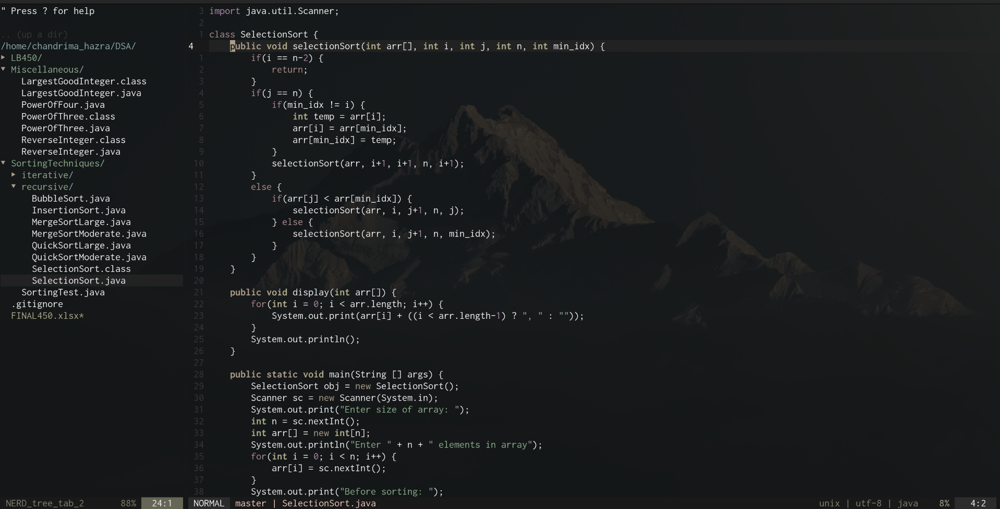
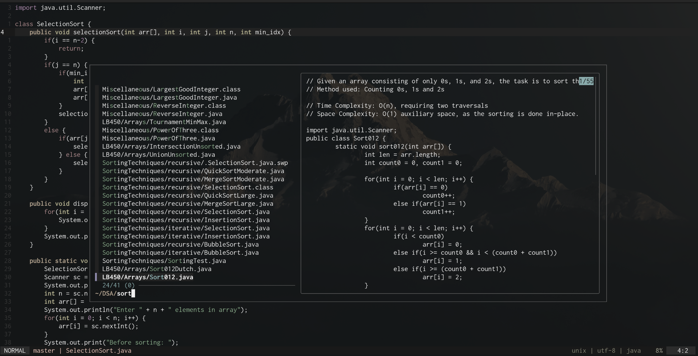
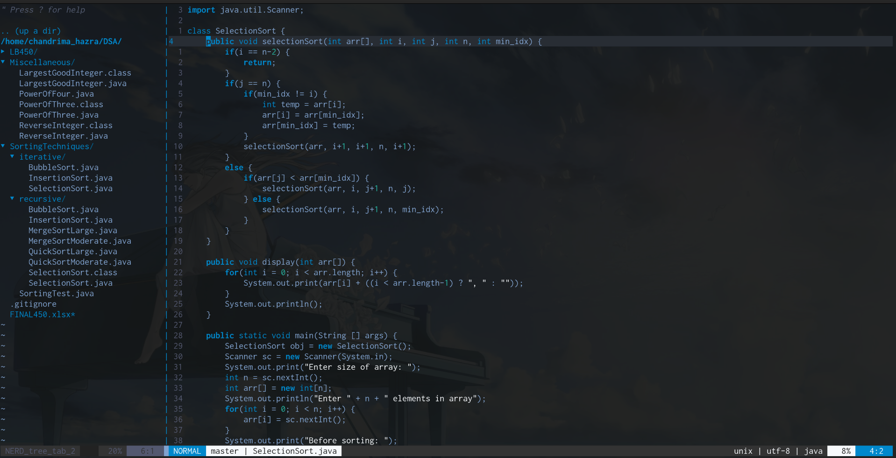
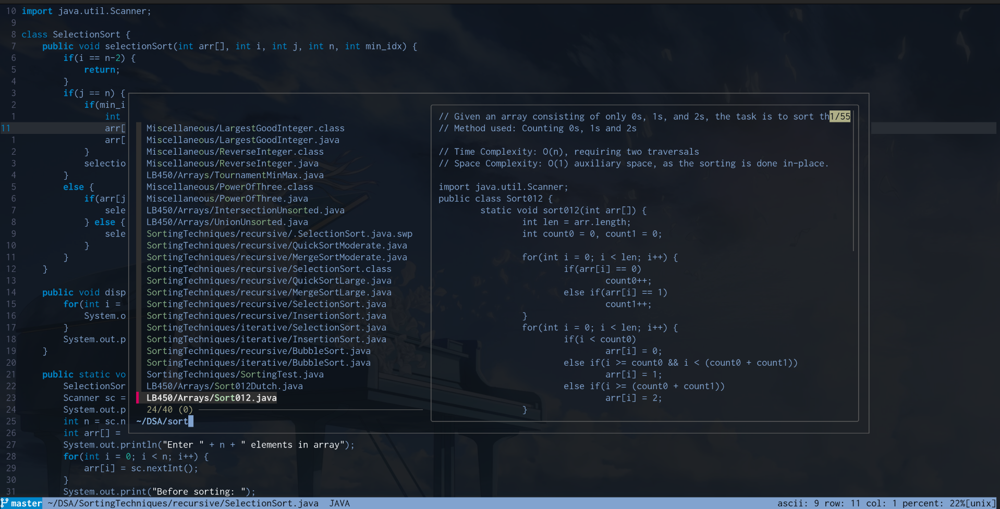

# My minimal vimrc

This is a simple and minimal vim configuration that I use.
Honestly, I don't know why I made this. No one's gonna read this... just like my DMs.

Anyways, I'll be switching to NeoVim very soon, so I just wanted to start with Vim first.

This config is mainly for Linux users (works on macOS too), cuz anyone using Windows must be happy with their VSCode extensions.


## Low-key features this vimrc offers
- Colorschemes: Gruvbox, Mountaineer Grey, Archery (all with dark backgrounds)
- ALE for asynchronous linting
- NERDTree for file navigation
- Custom status line with Git branch display
- Convenient key mappings for faster editing
- fzf for fuzzy file and text search
- Python script execution with the F5 key

It uses [vim-plug](https://github.com/junegunn/vim-plug) for plugin management.

## What does it look like??

You can use a different colorscheme from here : [list of vim colorschemes](https://github.com/rafi/awesome-vim-colorschemes)

### 1. Gruvbox


---

### 3. Mountaineer\_grey 





---

### 2. Archery 





---

## If you ever consider trying it out

### Just make sure you have

* Git (for plugin installation and Git branch detection in the status line)
* Python3 (for running scripts with F5)
* fzf (for fuzzy finding)
* GVim

If you want **transparent backgrounds and better font rendering** make sure you have **GVim** installed.

#### Installing GVim

**Debian / Ubuntu**

```bash
sudo apt update
sudo apt install vim-gtk3
```

**Fedora**

```bash
sudo dnf install gvim
```

**Arch Linux**

```bash
sudo pacman -S gvim
```

**openSUSE**

```bash
sudo zypper install gvim
```

Once installed, you can launch it with:

```bash
gvim
```

## Setting it up

### 1. Clone this repo

```bash
git clone --depth=1  https://github.com/hazraChandrima/vimrc.git
cd vimmy/
```

### 2. Backup your old `.vimrc` (if you have a superior vimrc)

```bash
mv ~/.vimrc ~/.vimrc.backup
```

### 3. Copy the files to your home directory

```bash
cp .vimrc ~/
cp -r .vim/ ~/
```

### 4. Install plugins

Open Vim and run:

```vim
:PlugInstall
```

That's all it takes...

## Key Mappings (you may change 'em if you want)

| Mapping           | Action                                                    |
| ----------------- | --------------------------------------------------------- |
| `jj`              | Exit insert mode                                          |
| `<leader>\`       | Jump back to the last cursor position                     |
| `<leader>p`       | Print current file to default printer                     |
| `<space>`         | Acts as `:` in command mode                               |
| `o` / `O`         | Open a new line below/above and return to normal mode     |
| `n` / `N`         | Move to next/previous search result and center the cursor |
| `Y`               | Yank from cursor to the end of the line                   |
| `<F5>`            | Save and run current Python file                          |
| `<F3>`            | Toggle NERDTree                                           |
| `Ctrl+j/k/h/l`    | Navigate between split windows                            |
| `Ctrl+Arrow Keys` | Resize split windows                                      |
| `Ctrl+p`          | Open fzf and fuzzy search files in the current directory  |


## If something goes wrong

It would be a shame. But the good news is, you're smart enough to fix it.

Jokes aside, you may reach out to me via hazrachandrima6@gmail.com
