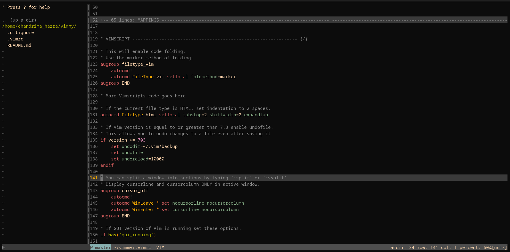

# My minimal vimrc

This is a simple and minimial vim configuration that I use often.
Honestly, I don't know why did I make this. No ones gonna read this... just like my DMs.

Anyways, I'll be switching to NeoVim very soon, so just wanted to start with Vim.

And most importantly, this is for Linux users, cuz anyone using Windows must be happy with their VSCode

## What does it look like??



## Low-key features this vimrc offers
- Gruvbox colorscheme with a dark background
- ALE for asynchronous linting
- NERDTree for file navigation
- Custom status line with Git branch display
- Useful key mappings for faster editing
- Python script execution with the F5 key

## If you consider trying it out

### 1. Install vim-plug

It uses [vim-plug](https://github.com/junegunn/vim-plug) for plugin management.

```bash
curl -fLo ~/.vim/autoload/plug.vim --create-dirs \
https://raw.githubusercontent.com/junegunn/vim-plug/master/plug.vim
````

### 2. Clone this repo

```bash
git clone https://github.com/hazraChandrima/vimmy.git
```

### 3. Backup your old `.vimrc` (if you have a superior vimrc)

```bash
mv ~/.vimrc ~/.vimrc.backup
```

### 4. Symlink this vimrc

```bash
ln -s ~/vimmy/.vimrc ~/.vimrc
```

### 5. Install plugins

Open Vim and run:

```vim
:PlugInstall
```

## Just make sure you have these

* Git (for plugin installation and Git branch detection in the status line)
* Python3 (for running scripts with F5)
* curl (for downloading vim-plug)
* Gruvbox theme (installed automatically by vim-plug)

## Key Mappings (you may change if you want)

| Mapping           | Action                                                    |
| ----------------- | --------------------------------------------------------- |
| `jj`              | Exit insert mode                                          |
| `<leader>\`       | Jump back to the last cursor position                     |
| `<leader>p`       | Print current file to default printer                     |
| `<space>`         | Acts as `:` in command mode                               |
| `o` / `O`         | Open a new line below/above and return to normal mode     |
| `n` / `N`         | Move to next/previous search result and center the cursor |
| `Y`               | Yank from cursor to the end of the line                   |
| `<F5>`            | Save and run current Python file                          |
| `<F3>`            | Toggle NERDTree                                           |
| `Ctrl+j/k/h/l`    | Navigate between split windows                            |
| `Ctrl+Arrow Keys` | Resize split windows                                      |


## If something goes wrong

It would be a shame. But the good news is, you're smart enough to fix it.
